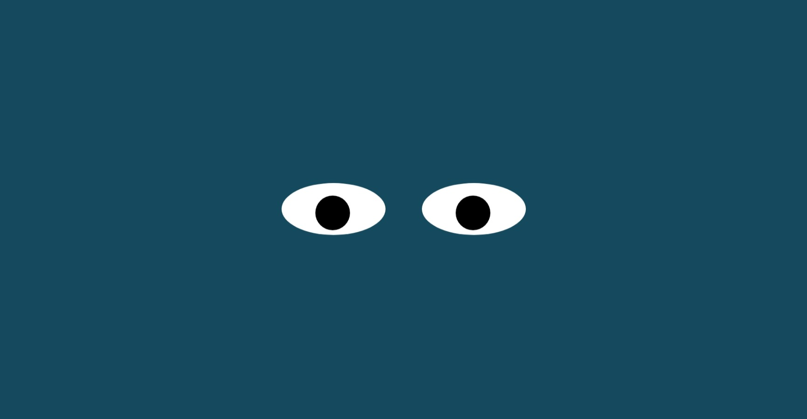

# Eye-Exercise

## Description
Hello, This is an assignment where the both eyes shoould  follow the mouse position on the screen using the mouse events.

## How to Run the file:
1. Fork the repository.
2. Clone the repository.
3. Install the dependencies by running npm install.
4. Run the project using npm start.
5. Open the project in your browser at http://localhost:3000.

## License
This project is licensed under the MIT License - see the LICENSE file for details.
